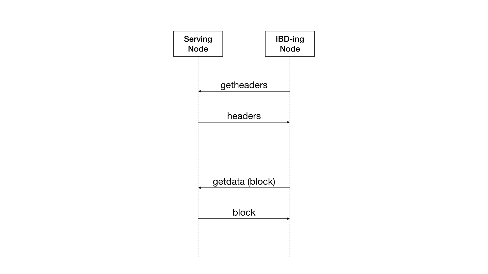
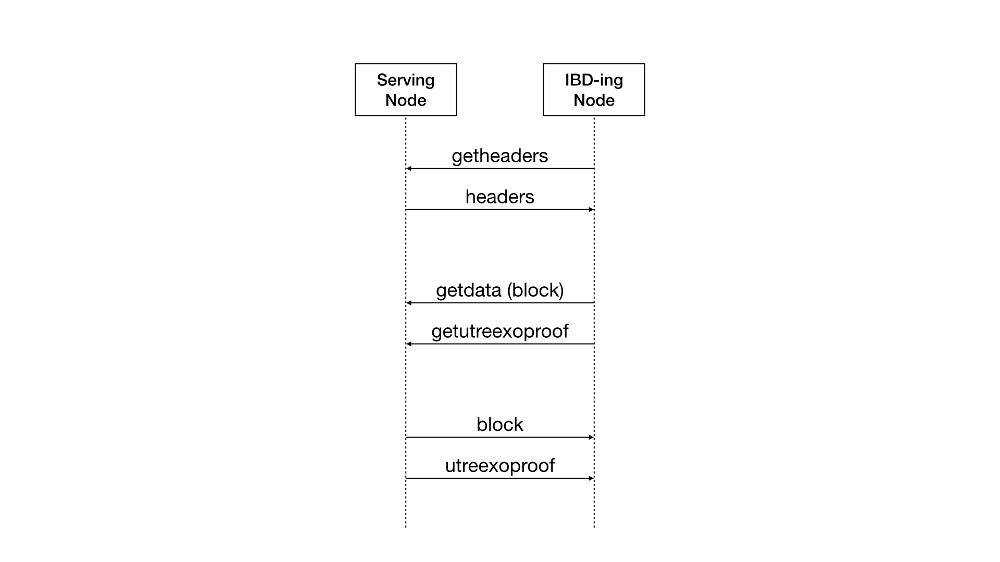
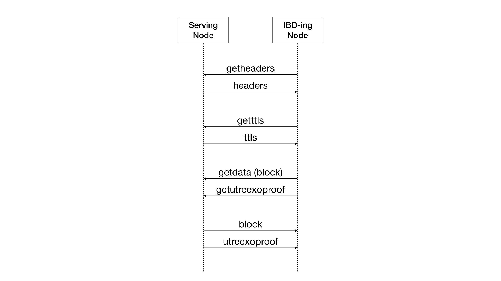
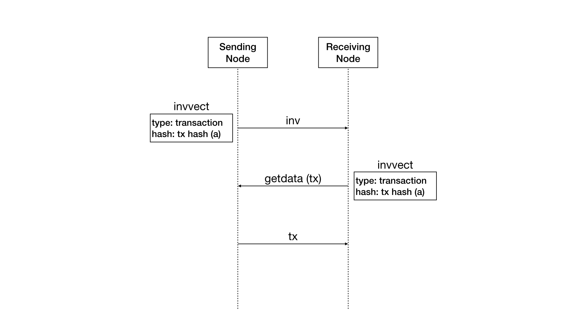
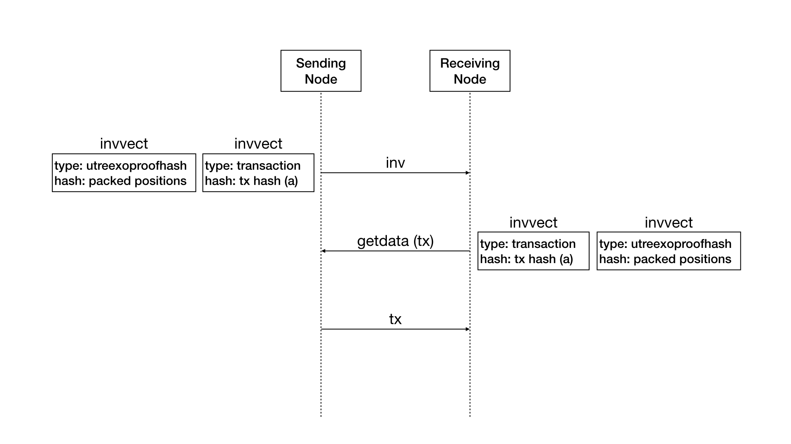
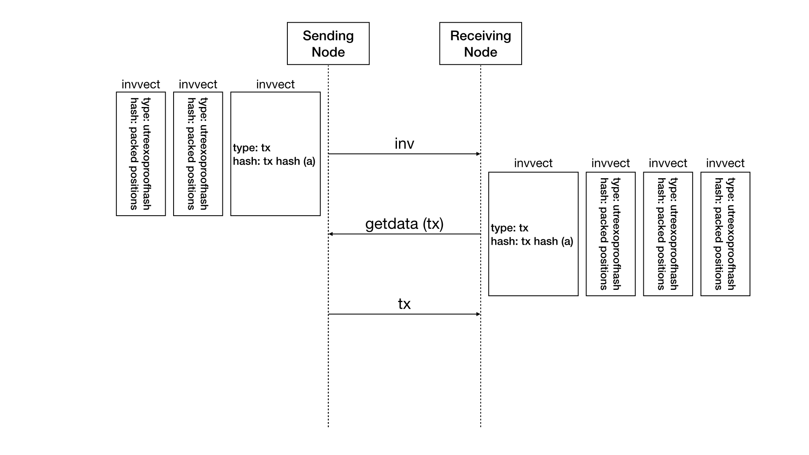
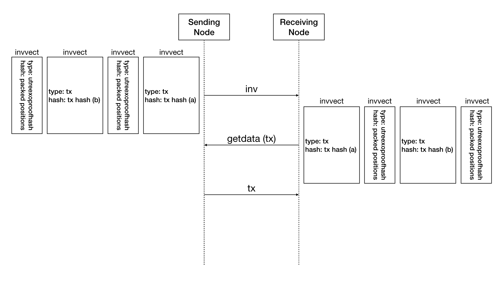
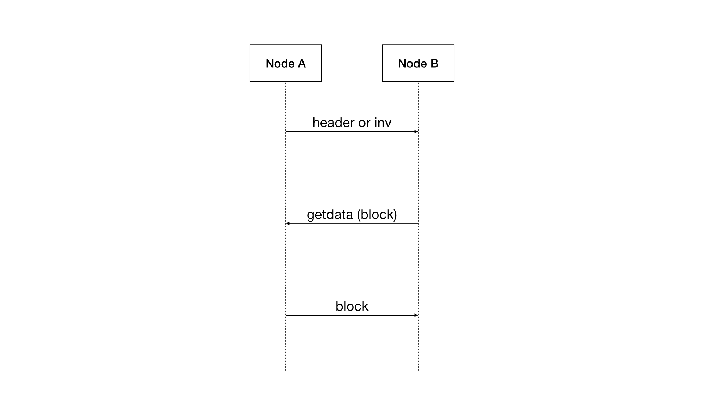
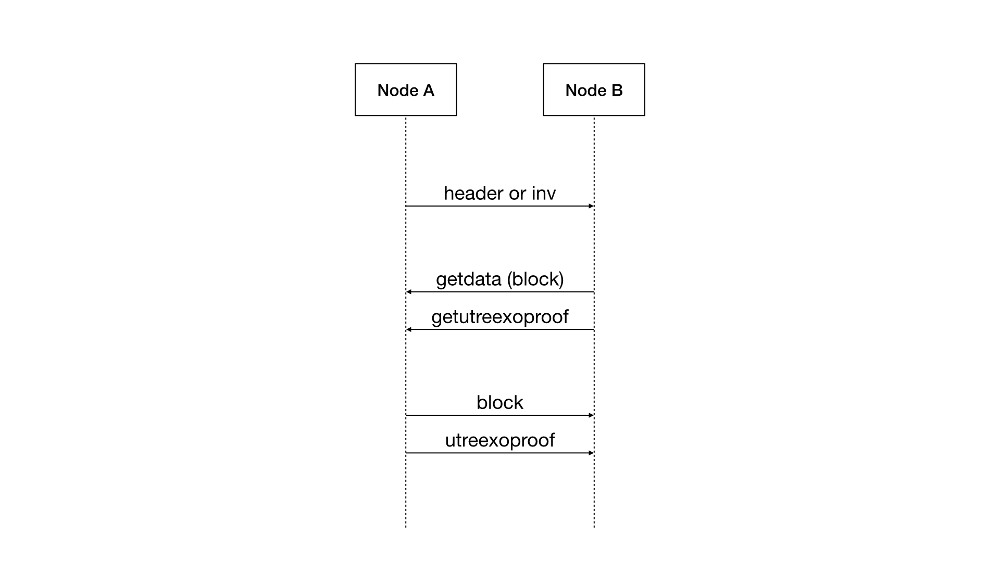
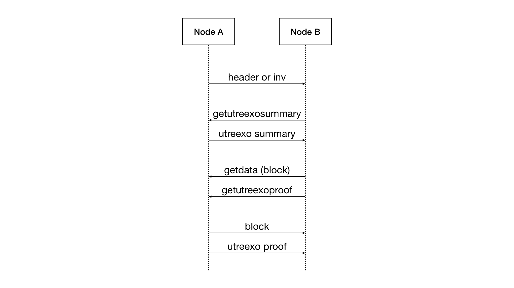

```
BIP: TBD
Title: Utreexo - Peer Services
Authors: Tadge Dryja <TBD>
         Calvin Kim <calvin@calvinkim.info>
         Davidson Souza <bip@dlsouza.dev>
Comments-URI: TBD
Status: Draft
Type: Specification
Created: 2024-08-08
License: BSD-3-Clause
Depends: BIP-???? (Utreexo - Peer Services)
```

# Abstract
Utreexo creates a compact representation of the UTXO set that only takes a couple of kilobytes.
When spending a transaction, one must provide an inclusion proof for the UTXOs being spent.
This BIP defines the networking-layer changes needed to allow nodes to exchange the utreexo proofs.
This document **does not** describe how to validate blocks and transactions using the provided data, check "Utreexo - Validation Layer" for more details.

# Motivation

Utreexo nodes require the inclusion proof to fully validate blocks and transactions.
Each block has an corresponding inclusion proof with it and this inclusion proof for blocks up to height 906,937 requires an additional 631.85GB, which is roughly 40GB less than the size of the block data.
Each transaction also has an corresponding inclusion proof with it and for normal transaction relay, the proof is roughly 3 times the size of the transaction.
It's still reasonable for a single node to download this extra data but little caching goes a long way in reducing the amount of data that one has to download.
We define the new P2P messages for the inclusion proofs to support caching to reduce bandwidth while also allowing a high bandwidth, low-latency usage.

# License

This BIP is licensed under the BSD-3-Clause license.

# Overview

## Requirements and Compatibility

Nodes implementing Utreexo can choose which messages to support.
There are a number of configurations possible, and this BIP does not restrict nodes to any subsets of messages.
That said, there are three likely types of nodes: Compact State Nodes (CSNs) which have the goal of minimizing data storage and download while performing block validation, and archive and bridge nodes which store more data and provide this data to CSNs.
Bridge nodes are nodes that can add inclusion proofs to mempool transactions, support the same set of messages as CSNs, and are in fact should be indistinguishable from CSNs on the network.
Archive nodes are able to serve the blocks and the inclusion proofs. However, they are not able to generate the inclusion proofs as they do not keep the full UTXO set.

Note that the archive and bridge capabilities of a node are separate; a bridge node can be bridge only, without previous block proof data, and an archive node doesn't need to be able to bridge.

The one exception to this flexibility is that archive nodes must provide both the blocks and the inclusion proofs.
While theoretically possible to split these two resources, the bock summaries are quite small relative to the block proofs, and it simplifies clients to be able to rely on being able to request both over the same connection.

## Pre-P2P: Bridge Building

When introducing Utreexo into an existing network, there are 2 thing needed before CSNs can operate.
First, archive nodes need to build proofs for old blocks to serve during the initial-block download (IBD).
Second, nodes need to build and maintain the UTXO merkle forest, and an index of outpoints to leaves of that forest, so that they can build proofs for new transactions.
Both of these processes happen without any p2p messages by taking an already existing, synchronized archive full node and going through its stored block data.

Once an archive and bridge node have been established, CSNs download blocks and inclusion proofs to IBD and maintain sync with the bitcoin network. 

## Initial Block Download



Current IBD is done by a headers-first block download, which downloads all the Bitcoin block headers, verifies that they connect and start downloading the actual block data for the headers.



Utreexo nodes will also perform the headers download but they also require the inclusion proof along with the block data.
Hence a Utreexo node will send a `getutreexoproof` message along with the `getdata` message for a given block.
This flow is the simpliest change and allows a Utreexo node to validate and perform IBD but this method does require downloading about 2 times compared to the current nodes as the inclusion proof for a block is roughly the same size as the block itself.



For utreexo nodes with memory to spare, we introduce a `ttl` messsage that will have a time-to-live value for each of the outputs in a given block.
With these ttl values, a node receiving the `ttl` message will be able to determine which output to cache with the clairvoyant algorithm[^1] which allows the ibd-ing node to reduce the bandwidth required in syncing the node in the most efficient way possible.
The node will have the block and the ttls for the outputs of the given block which it can then use to cache parts of the inclusion proof and only request the needed parts of an inclusion proof for future blocks.
We note that it is feasible for a node to receive incorrect ttl values from malicious nodes and this can negatively impact the bandwidth savings.
Nodes can mitigate this by not downloading ttl values too far into the future or by checking if the `ttl` message received was included in the accumulator hard-coded into the binary.
The this ttl commitment scheme is described in detail [here](##Commitment scheme for ttl messages) .

## Transaction relay



Current transaction relay is done by sending an inv message with the hash of the transaction and a type field that denotes that this hash represents a transaction.
If the node receiving the inv is does not have a tx matching that hash, it then requests for it using a getdata message.



The transaction relay for utreexo nodes doesn't add any extra round trips.
However, it does include extra inventory vectors in the inv message.
We introduce a new inventory vector type called `utreexoproofhash` which make up the extra information that a utreexo node will receive.
A hash with the type `utreexoproofhash` represents 4 utreexo merkle tree positions, each of them little endian serialized and taking up 8 bytes in the 32 byte hash.
When sending an inv message to a utreexo node for a tx, we append `utreexoproofhash` inventory vectors to represent the merkle tree positions for each of the utxos being referenced in the inputs of the tx.
The utreexo merkle tree positions are explained in detail in the bip "Utreexo Accumulator Specification".
Since the hash in an inventory vector is always 32 bytes, any unused space will be padded with the max uint64 value of 18446744073709551615.

With these merkle tree positions for the utxos referenced in the inputs, we can calculate the the needed positions of the merkle hashes to them.
These positions are then sent over in the `getdata` message as an another inventory vector.



There may be cases where the transaction is referencing more than 4 merkle positions.
In this case, the extra positions are added as another inventory vector.
There can be as many additional inventory vectors for the `utreexoproofhash`es as needed.
An inventory vector of type `utreexoproofhash` will be ignored if it's not prepended with an inventory vector of type `transaction`.



It's possible to have an inv message with multiple txs as well.
Note that an inventory vector of type `utreexoproofhash` MUST be appended to the `tx` inventory vector.

## Block Propagation



Legacy block propagation without Compact Blocks comprises of three steps:

1: Node A sends an inv message or a block header to Node B.
2: Node B makes a getdata request for the block.
3: Node A sends the block data to Node B.



The same block propagation with Utreexo nodes will look like so:

1: Node A sends an inv message or a block header to Node B.
2: Node B makes a getdata request for the block.
3: Node B makes a getutreexoproof request for the block.
4: Node A sends the block data to Node B.
5: Node A sends the utreexo proof to Node B.

Note that while Node A sent the inv or the blockhash to Node B, Node B is free to ask for the Utreexo proof from a node other than Node A.
This allows a Utreexo node to be notified of new blocks from non-Utreexo nodes.

## MSG_UTREEXO_SUMMARIES

Since there's no PoW required for the utreexo proof, the block may be valid and the proof may be invalid.
If the block header validation passed while the full block validation fails, Node B should request the utreexo proof from a different peer.
If the new proof and the block pass validation, we can conclude that Node A is malicious and ban the peer.



Since the utreexo proof is cached for each of the transaction in the mempool, it's possible to omit the proof hashes for the input utxos that we can already prove on our own.
This method looks like so:

1: Node A sends an inv message or a block header to Node B.
2: Node B makes a getutreexoblocksummaries request for the block.
3: Node A sends the utreexoblocksummaries message to Node B.
4: Node B calculates which proof hashes and leafdatas it needs to prove this block.
5: Node B makes a getdata request for the block to Node A.
6: Node B makes a getutreexoproof request for the block to Node A.
7: Node A sends the block data to Node B.
8: Node A sends the requested utreexo proof data to Node B.

As with the getutreexoproof message, Node B is free to ask for the utreexoblocksummaries message from a node other than Node A.
Since there's no commitment to anything in a utreexoblocksummaries message, the information given in it can be false.
Should the block fail to validate with this propagation, Node B should request the full proof from a different peer.
Should the proof and the block pass validation, we can conclude that Node A is malicious and ban the peer.

# Specification

Several new data structures and messages are introduced to make the IBD and tx relay possible.
All structures are little-endian encoded unless otherwise noted.

## New data structures

### Compact leaf data

For a CSN to learn the data associated with a UTXO, it must ask for a peer that has it.
To authenticate this data, it is committed into the accumulator, and therefore cannot be changed by peer.
The committed data is defined in BIP-VALIDATION#LEAF_DATA, but for some information in the leaf data, the receiving peer might already have it, so sending it again is a waste of bandwidth.
To save that bandwidth, we only send a Compact Leaf Data, that contains all missing information for the receiving peer to reconstruct the full leaf data.
A compact leaf data is defined as:

| Field        | type                         | Description     |
|--------------|------------------------------|-----------------|
| header code  | uint32                       | This is a value obtained by left shifting the block height that confirmed this transaction, and then OR-ing it with 1, only if this transaction is a coinbase. |
| amount       | int64                        | The amount in sats locked on this output |
| scriptPubkey | reconstructable scriptPubkey | The scriptPubkey in a reconstructable format, see [Reconstructable Script](###Reconstructable-Script) for more details |

### Reconstructable Script

For some script types (e.g. `ScriptHash`, `PubkeyHash`, `WitnessScriptHash`, `WitnessPubkeyHash`) the actual locking condition is not in the scriptPubkey, but a hash of it.
The script which is evaluated is provided as an element of the scriptSig or witness data.
Therefore, we can safely just omit the locking script hash from the UTXO data and reconstruct it from the witness or scriptSig.
A Reconstructable Script is a tagged union that lets nodes recreate the script without necessarily providing redundant information.
If we can reconstruct the committed hash from the transaction data, we just say which type should we expect.
Only if the actual script cannot be reconstructed from transaction data, like in the case of taproot outputs, we send the actual script.

The serialization and tag values are given below:

| Field   | Type                    | Description       | Required                 |
|---------|-------------------------|-------------------|--------------------------|
| tag     | 1-byte unsigend integer | Script type       | yes                      |
| length  | varint                  | The script length | only if tag type is 0x00 |
| script  | variable-length vector  | The actual script | only if tag type is 0x00 |

The possible values for the tag are:

| Value | Script Type         |
|-------|---------------------|
| 0x00  | Other               |
| 0x01  | Pubkey Hash         |
| 0x02  | WitnessV0PubkeyHash |
| 0x03  | ScriptHash          |
| 0x04  | WitnessV0ScriptHash |

### TTL Info

For all utxos that get added to the Utreexo merkle forest, a TTL info exists for it and includes information necessary for efficiently caching and requesting proofs.
The ttl value provides information to determine which leaves should be cached and the death position is used to calculate which positions in the merkle forest we need to prove a block.

| Field          | Type   | Description                                                                                                                                                          |
|----------------|--------|----------------------------------------------------------------------------------------------------------------------------------------------------------------------|
| ttl            | varint | The time-to-live value of a leaf in the utreexo merkle forest. The value is determined by the amount of leaves that were added to the accumulator since its creation |
| death position | varint | The position in the utreexo merkle forest when the leaf was removed                                                                                                  |

### Utreexo TTL

| Field        | Type                | Description                                                                                                                                                          |
|--------------|---------------------|----------------------------------------------------------------------------------------------------------------------------------------------------------------------|
| block height | uint32              | The time-to-live value of a leaf in the utreexo merkle forest. The value is determined by the amount of leaves that were added to the accumulator since its creation |
| length       | varint              | The length of the ttls                                                                                                                                               |
| TTLs         | vector of ttl infos | position in the utreexo merkle forest when the leaf was removed                                                                                                      |

### Utreexo Block Summary

The utreexo block summary is the data needed to calculate the missing merkle forest positions required to validate a given block.

| Field                      | Type                    | Description                                                                                                      |
|----------------------------|-------------------------|------------------------------------------------------------------------------------------------------------------|
| blockhash                  | 32 byte vector          | The hash of the block that this utreexo block summary is for                                                     |
| num adds                   | varint                  | The count of leaves added to the accumulator on the block this utreexo block summary is for                      |
| length of target locations | varint                  | The length of the target locations.                                                                              |
| target locations           | vector of uint64 values | The utreexo merkle tree locations of the leaf datas. MUST be in blockchain order. MUST include all the locations |

## New Messages

### MSG_UTREEXO_PROOF

`MSG_UTREEXO_PROOF` is all the data required for a CSN or archive node using the Utreexo accumulators to validate a Bitcoin block.

| Field            | Type                         | Description                                                                                                                               |
|------------------|------------------------------|-------------------------------------------------------------------------------------------------------------------------------------------|
| blockhash        | 32 byte vector               | The hash of the block that this utreexo proof proves                                                                                      |
| proof hashes     | vector of 32 byte vectors    | The hashes requested by MSG_GET_UTREEXO_PROOF. MUST be in tree order                                                                      |
| target locations | vector of uint64 values      | The utreexo merkle tree locations of the leaf datas. MUST be in blockchain order. MUST include all the locations or none of the locations |
| leaf datas       | vector of compact leaf datas | The preimage of the committed utxos requested byte MSG_GET_UTREEXO_PROOF. MUST be in blockchain order. See compact leaf data for details  |

### MSG_UTREEXO_TX
The proof hashes MUST be in merkle forest tree ordering.
See BIP [Utreexo Accumulator Specification](##Positions in the forest) for an explanation on how each of the hashes in the merkle forest are positioned.

Each of the target location represents the position of the leaf data at the same index.
While each leaf data represent a utxo in a given block, not all are added as per [Utreexo - Validation Layer](##Excluded UTXOs from the accumulator).

### MSG_GET_UTREEXO_PROOF

`MSG_GET_UTREEXO_PROOF` is a message to request the proof.

| Field              | Type                   | Description                                                      |
|--------------------|------------------------|------------------------------------------------------------------|
| blockhash          | 32 byte vector         | The hash of the bitcoin block that we want the utreexo proof for |
| include all        | boolean                | A boolean value to request all parts of the utreexo proof        |
| proof index bitmap | variable-length vector | A bitmap of the indexes the indexesf the leaf datas              |
| leaf index bitmap  | variable-length vector | The preimage of the committed utxos. See compact leaf data       |

### MSG_UTREEXO_TTLS

`MSG_UTREEXO_TTLS` is the requested group of Utreexo TTLs that includes the proof hashes needed to validate that the given ttls were committed in the provided binary.

| Field                      | Type                                | Description                                   |
|----------------------------|-------------------------------------|-----------------------------------------------|
| length of the utreexo ttls | varint                              | The length of the utreexo summaries           |
| utreexo ttls               | vector of utreexo summaries         | The vector of the requested utreexo summaries |
| length of the proof hashes | varint                              | The length of the proof hashes                |
| proof hashes               | vector of 32 byte hashes            | The vector of the requested utreexo summaries |

### MSG_UTREEXO_SUMMARIES

`MSG_UTREEXO_SUMMARIES` is a vector of the utreexo summaries that were requested.

| Field              | Type                                | Description                                   |
|--------------------|-------------------------------------|-----------------------------------------------|
| length             | varint                              | The length of the utreexo summaries.          |
| utreexo summaries  | vector of utreexo summaries         | The vector of the requested utreexo summaries |

### MSG_GET_UTREEXO_SUMMARIES

`MSG_GET_UTREEXO_SUMMARIES` is the message used to communicate which summaries we want.

| Field                | Type           | Description                                                                                                                         |
|----------------------|----------------|-------------------------------------------------------------------------------------------------------------------------------------|
| starthash            | 32 byte vector | The start hash of the bitcoin block that we want the utreexo summaries from                                                         |
| max receive exponent | single byte    | The number of summaries from the start hash that we want to request. Maximum block count of $2^{Max Receive Exponent}$ is requested |

## New Inventory Types

### MSG_UTREEXO_PROOF_HASH

Defined as `6`.
It's used in the `inv` and `getdata` messages to communicate positions in the Utreexo merkle forest.
MUST be appened to another `invvect` of type `MSG_TX`, `MSG_WITNESS_TX`, `MSG_UTREEXO_TX`, or a `MSG_WITNESS_UTREEXO_TX`.
Ignored if an `invvect` of type `MSG_UTREEXO_PROOF_HASH` is not pre-pended by any of the above 4 `invvect` types.

### MSG_UTREEXO_FLAG

Defined as `1 << 24`, it can be set with `MSG_TX` and `MSG_WITNESS_TX` to indicate in `getdata` messages that a Utreexo tx is desired.

### MSG_UTREEXO_TX

Defined as `16777217` or `1 << 24 | 1`.
Used to indicate in a `getdata` message that a utreexo tx is desired.

### MSG_WITNESS_UTREEXO_TX

Defined as `1090519041` or `1 << 30 | 1 << 24 | 1`.
Used to indicate in a `getdata` message that a witness utreexo tx is desired.

## Commitment scheme for ttl messages

We choose an arbitrary height `X` and go through each of `TTL info` in all the the `Utreexo TTL` values up until that height.
If the ttl in the `TTL info` is greater than the [numleaves](./utreexo-accumulator-bip.md#Definitions) value of the Utreexo accumulator at the chosen height `X`, we reset the `death position` and the `ttl` values to their default of 0.
Then these `Utreexo TTL` values are hashed with the hash function SHA512/256[^2] and added in height order to the commitment Utreexo accumulator.
Note that this commitment Utreexo accumulator is separate from the Utreexo accumulator being used to represent the UTXO set.

The resulting [numleaves](./utreexo-accumulator-bip.md#Definitions) and [roots](./utreexo-accumulator-bip.md#Definitions) are committed into the distributed binary which then the nodes opting in can use to validate that the `Utreexo TTL` values received from peers was generated in the same way as the described commitment scheme.

## Signaling

This BIP allocates two new service bits:

| NODE_UTREEXO         | 1 << 12 | Nodes that signal this bit MUST be able to propagate inclusion proofs for new blocks and transactions and for their other advertised services. Nodes signaling NODE_UTREEXO and NODE_NETWORK_LIMITED MUST serve inclusion proofs for the last 288 blocks. Nodes signaling NODE_UTREEXO and NODE_NETWORK MUST serve inclusion proofs for all historical blocks.
| NODE_UTREEXO_ARCHIVE | 1 << 13 | Nodes that signal this bit MUST be able to serve historical inclusion proofs for all blocks. These nodes do not have to serve historical blocks.

NODE_UTREEXO signals that the node understands Utreexo and will serve inclusion proofs based on their other service bits.
NODE_UTREEXO_ARCHIVE is specifically for nodes that only keep the historical inclusion proofs for all the blocks.
We have a separate NODE_UTREEXO_ARCHIVE service bit as it's possible to get historical blocks from a NODE_NETWORK peer and the inclusion proofs for those blocks from a NODE_UTREEXO_ARCHIVE.

Example cases:

Historial blocks + inclusion proofs for historical blocks + inclusion proofs for txs and new blocks: NODE_NETWORK | NODE_UTREEXO_ARCHIVE | NODE_UTREEXO 
Latest 288 blocks + inclusion proofs for latest 288 blocks + inclusion proofs for txs and new blocks: NODE_NETWORK_LIMITED | NODE_UTREEXO 
Inclusion proofs for txs and new blocks: NODE_UTREEXO 
Inclusion proofs for historical blocks: NODE_UTREEXO_ARCHIVE

# References

[^1]: https://en.wikipedia.org/wiki/Page_replacement_algorithm#The_theoretically_optimal_page_replacement_algorithm
[^2]: https://eprint.iacr.org/2010/548.pdf
